# User guide

The guide will go over the deployment of the Exasol Azure helper Functions briefly and then focus on using them in Azure Data Factory.

## Requirements

An Azure subscription with sufficient privileges to create resource groups, storage accounts, function apps and an Azure Data Factory.

## Deployment

A full section on all deployment options available for Azure Functions can be found in the Azure function docs under the how-to guides: [Zip push deployment for Azure Functions | Microsoft Docs](https://docs.microsoft.com/en-us/azure/azure-functions/deployment-zip-push)

In this guide I'll elaborate on one of the easiest user-friendly ways to set up Azure functions. 

The Microsoft documentation on deploying azure functions is way more exhaustive so if this doesn't cover your needs you might find a better option there.

Let's get started:

### Zip Deployment using the Azure Portal and Azure CLI:

Setting everything up in the Azure portal:

Navigate to the Azure portal and log in if you haven't done so yet: [Microsoft Azure](https://portal.azure.com/#home)

On the dashboard, click on 'Create a resource'.

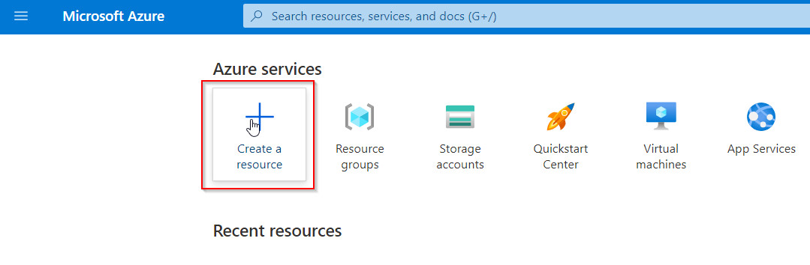

Search for 'function', then pick 'Function App'.

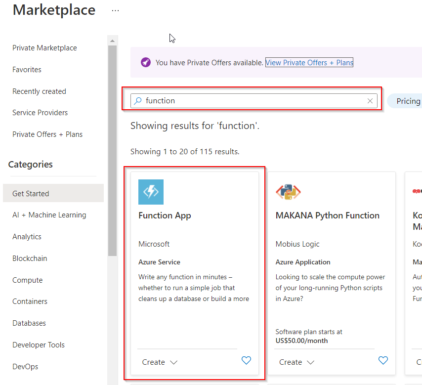

Click 'Create'.

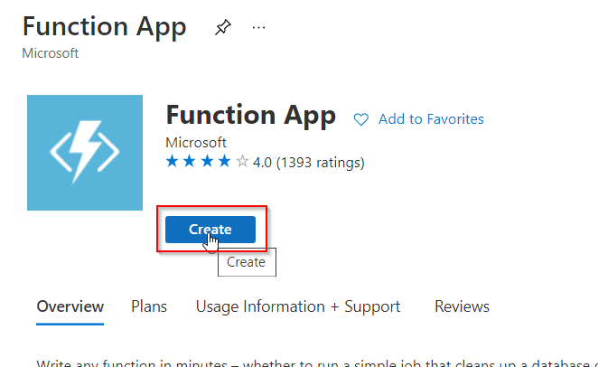

Now we need to do some setup:

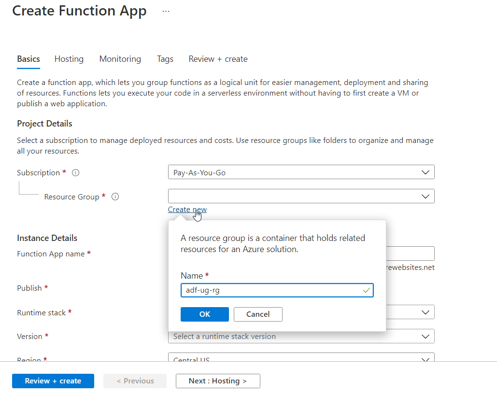

Create a new resource group (or use an existing one if you want). Take note of the name.

Pick a (unique) function app name.

Pick '.NET' as the runtime stack and pick '3.1' as the version.

Pick the region that fits you the most (this will probably the same region as where you host the Azure Data Factory as well).

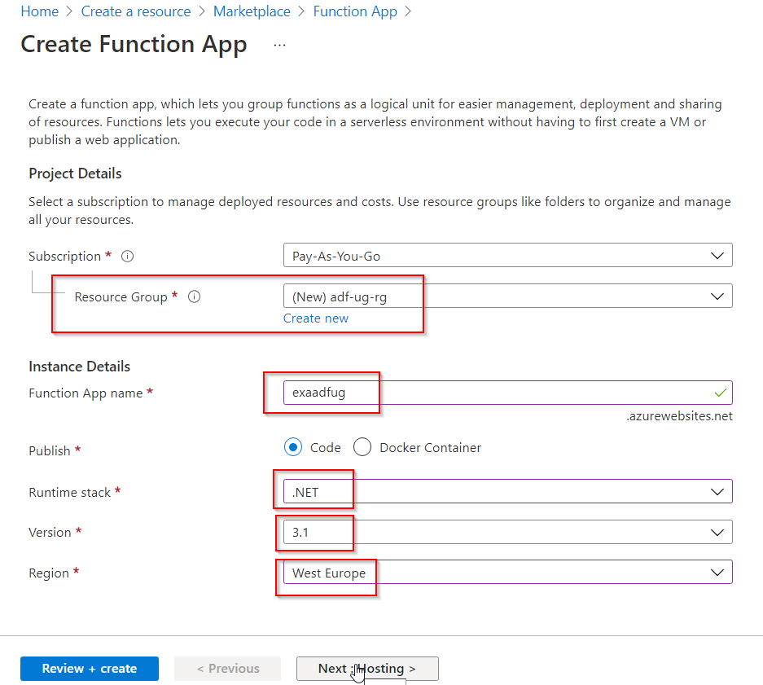

Next, press 'Hosting'. This will bring you to the next setup screen.

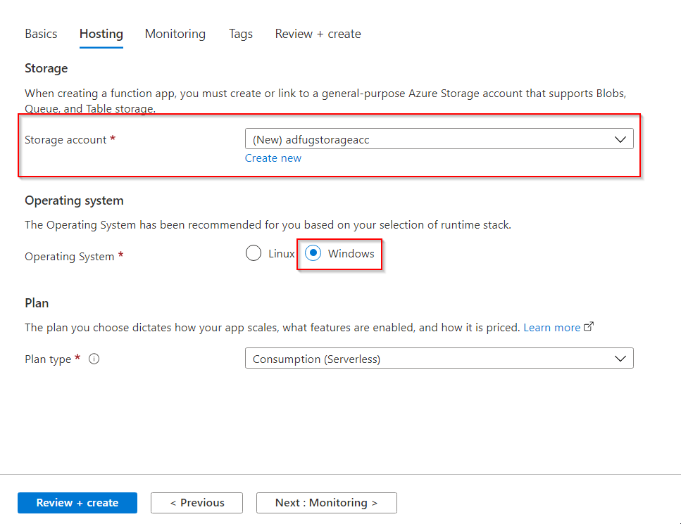

Create a new storage account name (recommended) or use an existing one. 

Take note of the name.

As operating system pick 'Windows' (this is because we use a .dll from the Exasol ADO .NET data provider that's not cross-platform).

Press 'Review + Create' and then press 'Create'.

You'll get a notification saying 'Deployment is underway'. This might take a minute.

Once the deployment is complete you'll get a notification and you can navigate to the resource. Do so.

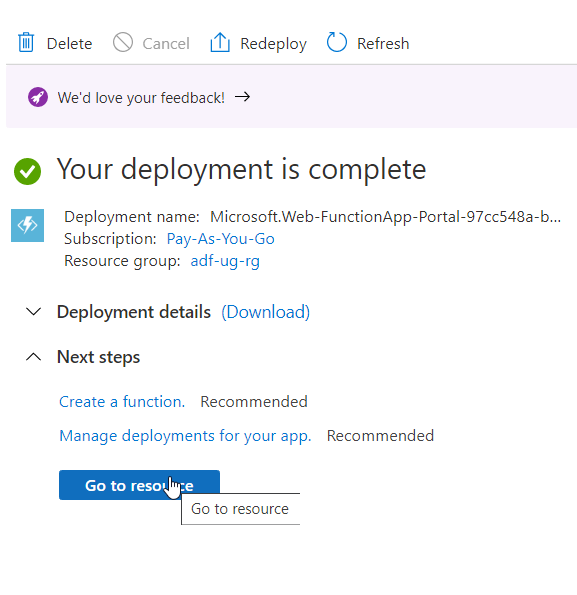

We've now succesfully created our Azure functions app. You can already take a look around. 

As you see there are no functions yet so our next step will be uploading these functions.

For this we'll use the Azure CLI tools.

#### Install the Azure CLI (get it here):

[Install the Azure CLI for Windows | Microsoft Docs](https://docs.microsoft.com/en-us/cli/azure/install-azure-cli-windows?tabs=azure-cli)

#### Get the Zipped Release of the Exasol Azure Helper Functions

Get the packaged version of the exasol Azure Data Factory functions here:

https://github.com/exasol/azure-data-factory-functions/releases/download/1.0.0/adffunctions.zip

#### Deploy the zipped functions using the azure CLI

Using the provided .zip in the release you can easily deploy the Azure functions.

Download the .zip

Use Azure CLI:

Login:

Open a command line window ("cmd") or powershell or a terminal of your choice

Type:

```
az login
```

Your preferred browser will open and you will be able to login.

Now navigate to the folder where you downloaded the packaged zip file and run the following command:

```
az webapp deployment source config-zip -g resourceGroupName -n functionName --src $sourceZipPath
```

In our case this would be:

```
az webapp deployment source config-zip -g adf-ug-rg -n exaadfug --src adffunctions.zip .
```

Running this command might take a while.

If everything is succesful you'll get a JSON response describing the resource and that its ProvisioningState "succeeded".

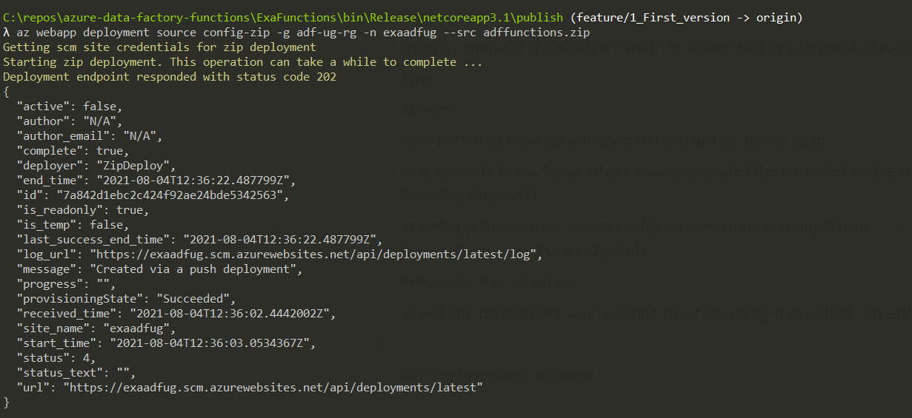

If you navigate back to your Function App and click on the Functions tab you will see that the helper functions are now present:


### Alternate approach : Deploying to Azure using Visual Studio or Visual Code 'Publish'

These methods may be a bit more involved and require you to have Visual Studio or Visual Studio Code installed but might be more practical if you want to alter or add some of the behaviour of these functions yourself.

You'll find guides for Visual Studio here: https://docs.microsoft.com/en-us/azure/azure-functions/functions-create-your-first-function-visual-studio and for Visual Studio code here: [Create a C# function using Visual Studio Code - Azure Functions | Microsoft Docs](https://docs.microsoft.com/en-us/azure/azure-functions/create-first-function-vs-code-csharp) 

## Using the functions in Azure Data factory.

If you haven't done so yet, create a 'Data Factory' in Azure.

Open 'Azure Data Factory Studio'.

### Setting up a linked service to your function app

Let's set up a linked service to our function app so we can use these functions in our pipelines.

Click on the 'manage' tab icon (wrench in a toolbox icon) to the left.

Under 'Connections' Select 'Linked services', then Click 'New'.

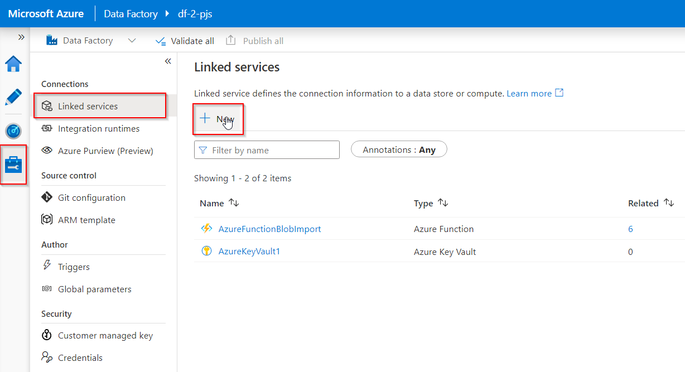

Click the Compute tab at the top, select 'Azure Function'.

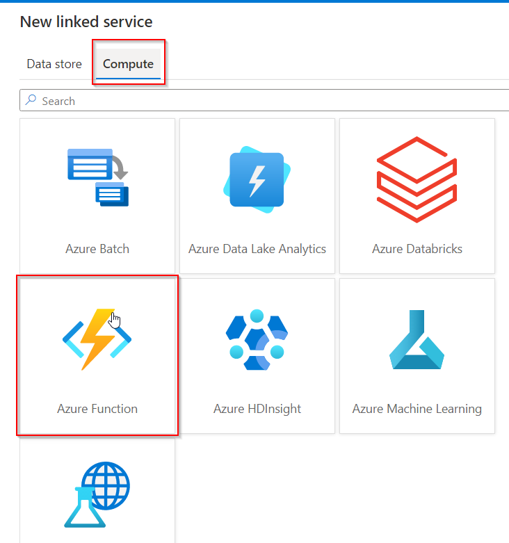

We have some configuration to do:

Pick a  good name,

as integration runtime, select the 'AutoResolveIntegrationRuntime',

select your Azure subscription and your Azure Function App url (both are dropdowns).

The last thing you got to fill in is the 'Function key'.

 This key is used to prevent others from accessing your Azure functions and to authenticate your requests from within Azure Data Factory.

You can find this key (or create an additional one) in your Function App under Settings:

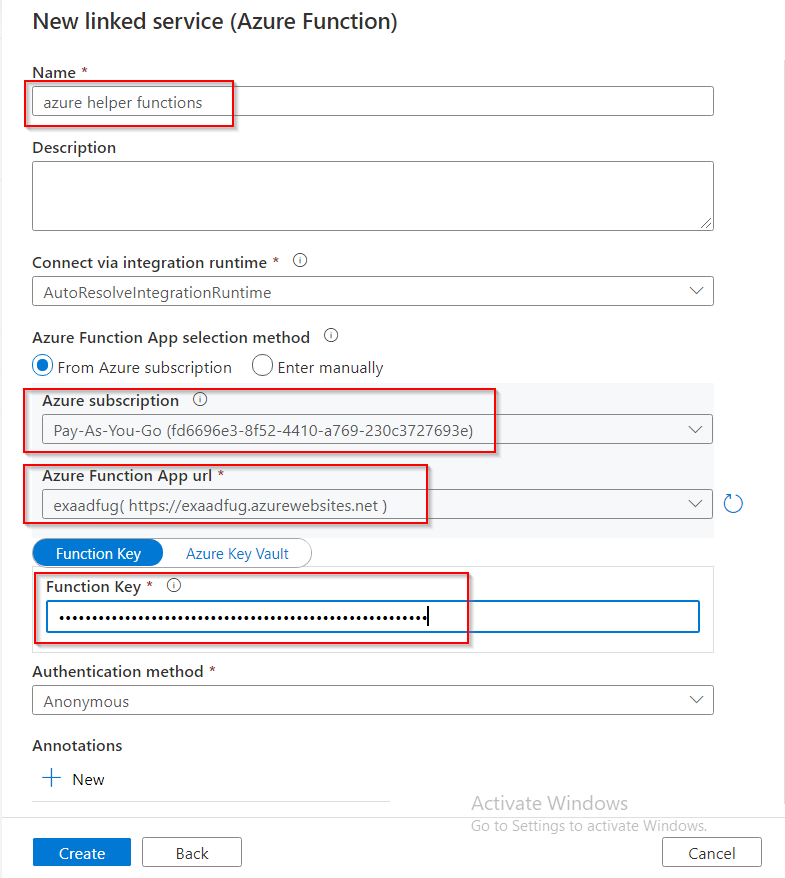

Open a new tab in your browser and navigate to your Function App you set up in the earlier steps.

In your Function App, select the 'App keys' tab. 

Under 'Host keys' you'll see the default key. We'll use this key, if you wish you could also create an additional key and use that one.

Click the eye icon and then the copy icon to copy the key to your clipboard. Paste this key into the Function key field of the new linked service we're creating.

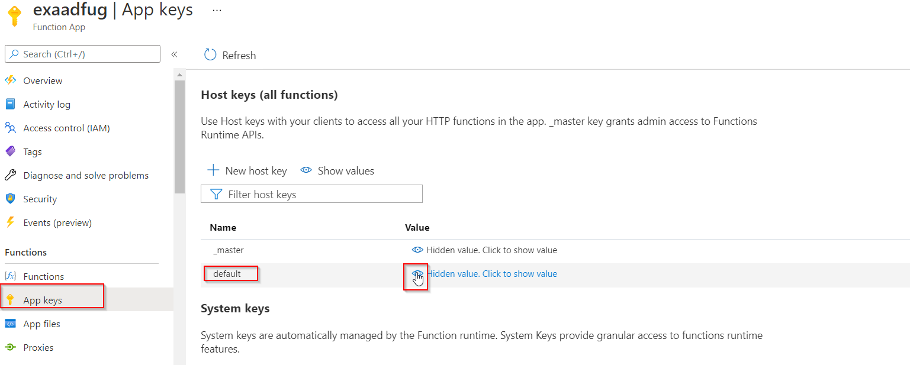

Click 'Create' to create the linked service.

Click 'Publish all' at the top.

This concludes the setup phase. We're now ready to start using these functions in our pipelines.

Open the 'Author' tab.

### Using the Exasol Azure Functions in your pipelines

All 3 functions are currently implemented using POST methods where you send a JSON body containing the parameters.

#### Query method

Let's start with using the Query method.

Create a new pipeline, click on the '+' on the left, select pipeline. Give the pipeline a sensible name. 

Now let's drag in an Azure Function Activity and let's give it a name as well.

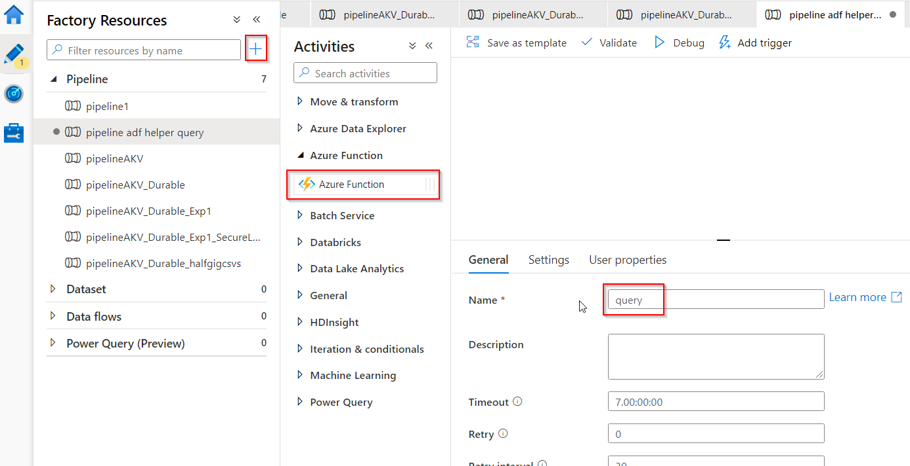

Switch to the settings tab of the Azure Function Activity: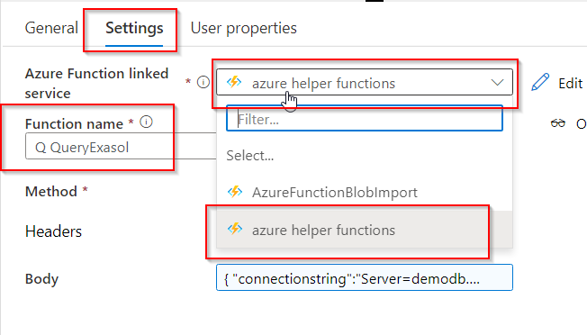

We need to select the linked service we just created in a dropdown here.

Then we'll need to type in the name of the Azure Function we want to use, in this case 'QueryExasol'.

Select 'POST' as the Method. Click in the body. 

An option to 'Add dynamic content' will appear.

While you could just copy paste the JSON body for the request below in the Body field I prefer pasting and working with it in the dynamic content tab because it's easier to format and you get an editor of sorts.

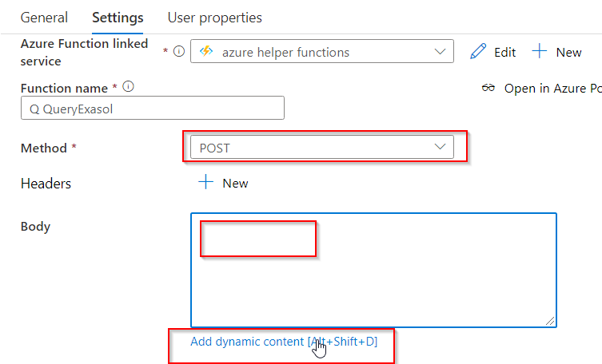

After clicking 'Add dynamic content' a tab will open to the right. All that's left to do now is paste in the request body:

```
{
"connectionstring":"Server=demodatabase.exasol.com;Port=8563;UID=yourusername;PWD=yourpassword",
"query":"SELECT COMPANY FROM CHICAGO_TAXI.COMPANIES"
}
```

In this case it's 2 parameters, both of them are required. 

The `connectionstring` parameter is the connection string of the exasol database.

The `query `parameter is whatever query you want to run.

Note: Currently only SELECT statements are supported.

When you validate the pipeline and look at the output you will see  query data under 'Results' in the returned JSON.

You can then extract this data and further work with it in a new activity using the output.

##### Input values

You can enter the values in the POST request body as plaintext, which is the simplest, but you could also use pipeline parameters,  global parameters, variables or data from previous activities.

We recommend storing my connection strings as secrets in the Azure Key Vault and then fetching them using web activities in the pipeline as an earlier step.

There's a great article on how to set this up here:

[Use Azure Key Vault secrets in pipeline activities - Azure Data Factory | Microsoft Docs](https://docs.microsoft.com/en-us/azure/data-factory/how-to-use-azure-key-vault-secrets-pipeline-activities)

In this case the POST body would then look somewhat like this:

```
{
"connectionstring":"@{string(activity('Get Exasol Azure 1 Connection String Secret').output.value)}",
"query":"SELECT COMPANY FROM CHICAGO_TAXI.COMPANIES"
}
```

### Azure Blob Storage Csv bulk import (durable)

This function is built for bulk import of many, large csv files from Azure Blob Storage into the Exasol Database.

The setup for this function is a little bit more involved than the query one since this is a durable function.

#### Add the azure function activity

First, let's add a new 'Azure Function Activity' to our pipeline.

As before, we select our Azure Function Linked Service

For the function name we want to call we pick: 'DurableCsvBulkImportFromBlobStorage_HttpStart'

Select POST as the method.

For the body, let's select 'add dynamic content again' and paste in the following body:

```
{
"dbconnectionstring" : "@{string(activity('Get Exasol Azure 1 Connection String Secret').output.value)}",
    "dbtable": "[test].[PERSONS]",
    "storageaccountconnectionstring": "@{string(activity('Get Storage Account Connection String Secret').output.value)}",
    "storageaccountcontainername": "pjs-test-jun-container",
    "storageaccountcontainerpath": "randomcsvs",
        "filesprocessedinparallel" : "1"
}
```

Let's go over the parameters/keys:

`dbconnectionstring `is the connection string of the exasol database.

`dbtable `is the schema.table name you want to insert data into.

`storageaccountconnectionstring `is the connection string of the Azure storage account where the csv files are stored, it can be found under the 'Access Keys' tab of the Azure Storage Account.

`storageaccountcontainername `is the name of the container in the Azure storage account where the csv files are located

`storageaccountcontainerpath `is the path of the csv files in the container that you want to import data from. This is an optional parameter. If you don't fill it in it it will import data from all the items in the container. You could also specify 1 file using this path.

`filesprocessedinparallel `is the amount of files processed in one operation. This is also an optional parameter. The default size is 1. In case of lots of smaller csv files it makes sense to increase this. If you have very large csv files then 1 or a lower number makes more sense.

#### Adding a Web Activity to signal when the durable function has finished

The next step, since this is a durable function, is to add another Web Activity to detect when the operation has finished.

Let's drag in a 'Web Activity' next to the Azure Function Activity we just created and connect the output of the Azure Function Activity to the Web Activity by dragging the arrow from the green end of the Azure activity to the Web activity.

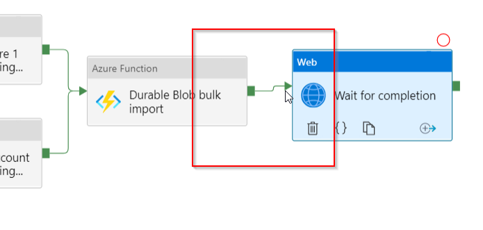

Go to the settings tab of the Web Activity, there add the following as the Url:

`@activity('Durable Blob bulk import').output.statusQueryGetUri`

 (if you click 'Add dynamic content' you'll be able to select the previous activity under 'Previous Activity Outputs'):

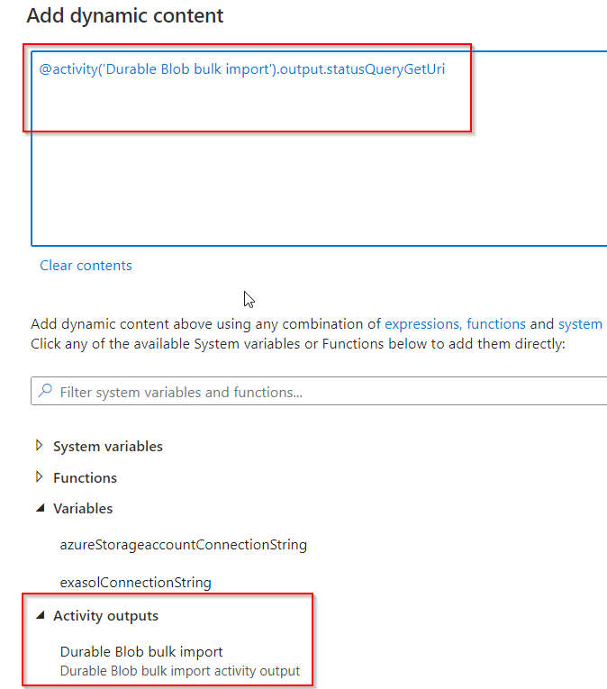

The Web Activity will poll here until the bulk import has succesfully finished or failed.

Note: If you want to keep your monitoring logs clear of sensitive data the Secure input option won't be enough because the final result will include the input (which contains connectionstrings and whatnot) as part of the response.

For this you can add the following to your Web Activity url:

`@concat(activity('Durable Blob bulk import').output.statusQueryGetUri,'&showInput=false')`

This way the result will not contain the  actual input.

### Csv bulk import

In case of smaller datasets it's also possible to just use the non durable csv import function. While the setup is a little bit simpler, the duration limit for these operations is at maximum 230 seconds so I recommend that you always use the durable version of the function.
