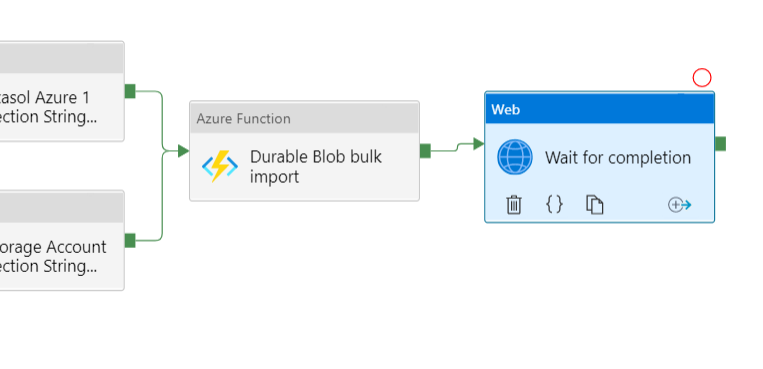

# Exasol Azure Data Factory Functions

This repository contains auxiliary azure functions for use in Azure Data Factory pipelines.

Included so far :

- Azure Blob Storage CSV bulk import functions
- Query function

Please see the [user guide](doc/user_guide.md) for detailed instructions.

The project uses [ADO.NET Data Provider | Exasol Documentation](https://docs.exasol.com/connect_exasol/drivers/ado_net.htm) for connecting and executing queries on the Exasol database.

The CSV bulk import function being utilized is documented here:

[Load Data from Azure&#160;Blob Storage | Exasol Documentation](https://docs.exasol.com/loading_data/load_data_azure_blob.htm)
